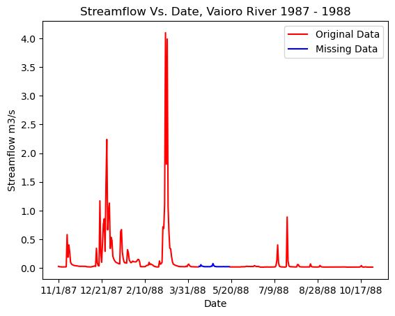
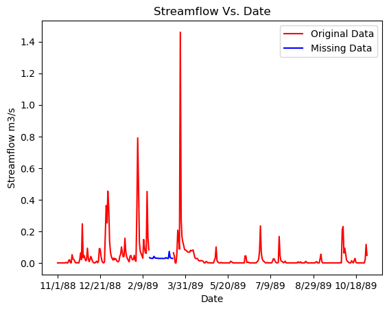
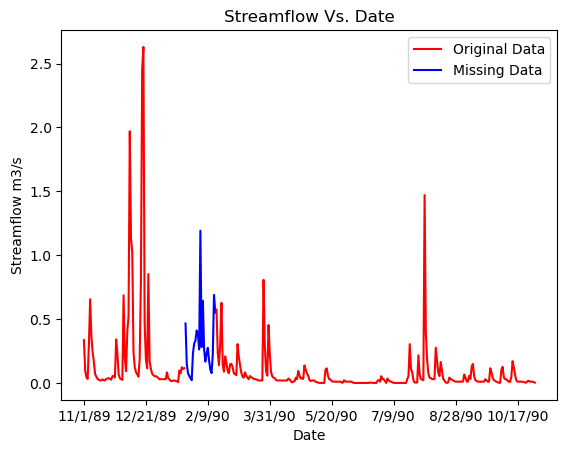
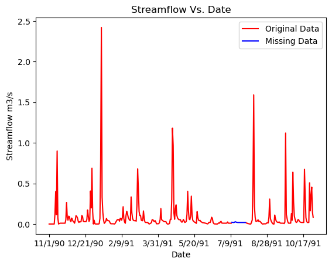

# Infilling Missing Streamflow Data in Time-Series Using Simple Linear Regression (CSULB Undergraduate Research 2023)

This repository contains code and notebooks for a hydrologic time-series project focused on infilling missing daily streamflow data using simple linear regression. The analysis uses multi-year records from three stream gages on the island of Mo'orea, French Polynesia (Tautuapae River, PK 20 Est River, and Vaioro River) to improve inputs for a machine learning model of submarine groundwater discharge.

All work is implemented in Python using Jupyter Notebooks:

- `Vaioro 1987-1988.ipynb`
- `Tautuapae 1988-1989.ipynb`
- `Tautuapae 1989-1990.ipynb`
- `Tautuapae 1990-1991.ipynb`

---

## 1. Project Overview

Streamflow records from gage stations often contain gaps due to equipment failures, shifting channels, or periods of very low flow. These gaps can bias hydrologic models and reduce confidence in long term water balance estimates. In this project, I review and implement several approaches for infilling missing flows, with a focus on simple linear regression between nearby gages.

I use complete time-series from one gage as an independent predictor and regress gages with missing values against this reference station. The resulting regression models are then applied to estimate missing flows and create continuous time-series for each site.

The project is based on the following ideas from the literature:

- High flow periods are often better captured with regression methods, while recession methods perform better during low flow periods (Mfwango et al., 2018).
- Regression analysis is one of the most widely used methods for estimating missing streamflow from nearby rivers (Mfwango, 2018).
- A range of other methods exist for infilling missing flow data, including manual inference, serial interpolation, scaling factors, equipercentile techniques, and hydrologic or machine learning models (Harvey et al., 2010; Arriagada et al., 2021).

---

## 2. Methods

The workflow in this repository follows these main steps:

### 1. Data preparation
   - Load daily streamflow records from three gages in Mo'orea.
   - Identify missing values for each station and subset data by hydrologic year.
   - Split each record into:
     - Group A: rows with missing values.
     - Group B: rows with complete data.

### 2. Simple linear regression
   - Select a nearby gage with complete data as the independent variable.
   - For Group B, extract:
     - `X`: streamflow at the independent (donor) gage.
     - `y`: streamflow at the target gage with gaps.
   - Fit a simple linear regression model:
     \[
     y = aX + b
     \]
   - Apply the fitted model to Group A to estimate missing streamflow values at the target gage.

### 3. Model evaluation
   - Compare predicted values with observed data in periods where both exist.
   - Use standard error metrics to assess the performance of the regression model:
     - Mean Absolute Error (MAE)
     - Mean Square Error (MSE)
     - Root Mean Square Error (RMSE)

### 4. Application to multiple gage pairs
   - Regress Tautuapae River flows against PK 20 Est River (1987–1988 and 1989–1990).
   - Regress Tautuapae River against Vaioro River (1987–1988 and 1990–1991).
   - Regress Vaioro River against PK 20 Est River (1987–1988) and PK 20 Est River against Vaioro River (1988–1989).

These infilled time series are then used as improved inputs for a machine learning model that estimates submarine groundwater discharge on remote tropical islands.

---

## 3. Requirements

This project uses Python and the following core libraries:

- `pandas` for time series handling and data cleaning
- `numpy` for numerical operations
- `matplotlib` for plotting
- `scikit-learn` (or another regression package) for simple linear regression

---

## 4. Figures

Vaioro River 1987 – 1988

Tautuapae River 1988–1988

Tautuapae River 1989–1990

Tautuapae River 1990–1991

---

## 5. References

- Arriagada, Pedro, et al. “Automatic gap-filling of daily streamflow time series in data-scarce regions using a machine learning algorithm.” Journal of Hydrology, vol. 598, 2021, p. 126454, https://doi.org/10.1016/j.jhydrol.2021.126454.

- Harvey, C., et al. “Developing best practice for Infilling Daily River Flow Data.” Role of Hydrology in Managing Consequences of a Changing Global Environment, 2010.

- Mfwango, Lusajo H, et al. “Estimation of missing river flow data for hydrologic analysis: The Case of Great Ruaha River Catchment.” Hydrology: Current Research, vol. 09, no. 02, 2018, https://doi.org/10.4172/2157-7587.1000299.

---

## 6. Acknowledgements

I would like to thank my mentors, Dr. Matthew Becker and Benjamin Bigarre, for introducing me to academic research and for their support throughout this project.
